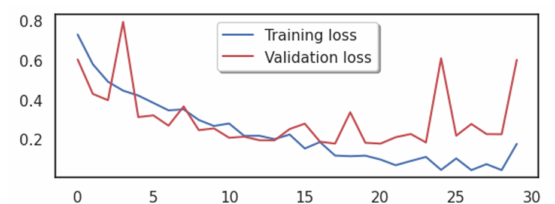
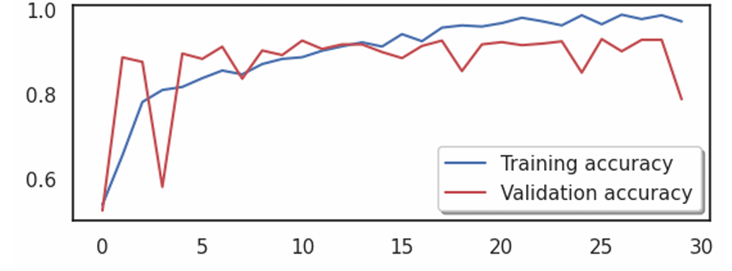
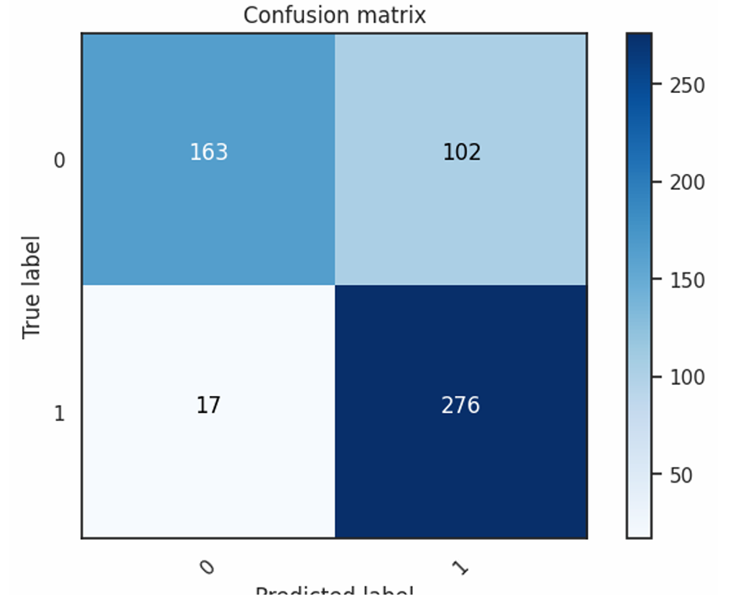

# Deepfake Image Detection using Error Level Analysis (ELA) and CNN

This project leverages **Error Level Analysis (ELA)** and a **Convolutional Neural Network (CNN)** to detect deepfake images. The approach uses the CASIA dataset, processes images through ELA, and trains a CNN to classify real vs. fake images based on compression artifacts.

---

## 🧠 Project Overview

- **Dataset**: [CASIA v2](https://www.kaggle.com/datasets/sophatvathana/casia-dataset?resource=download) (Authentic and Tampered images)
- **Technique**: Error Level Analysis to highlight tampered regions
- **Model**: Convolutional Neural Network (TensorFlow/Keras)
- **Evaluation**: Accuracy, loss curves, and confusion matrix

---

## 🖼️ What is ELA?

Error Level Analysis identifies areas within an image that exhibit different levels of compression, revealing possible tampering.

  
  

---

## ⚒️ How It Works
ELA Conversion: Converts every image into an ELA image.

Preprocessing: Normalizes, resizes to 128x128, and flattens for model input.

Model Architecture:

Two Conv2D layers

MaxPooling + Dropout

Dense layers with softmax output

Training: 80/20 train-validation split with EarlyStopping

Evaluation: Accuracy, loss, and confusion matrix visualizations

---

## 📈 Training Performance

   

---

## 🔍 Confusion Matrix

  

---

## 🧪 Requirements
pip install numpy pandas matplotlib seaborn pillow scikit-learn tensorflow

---
## ▶️ Running the Code
bash
python deepfake.py
